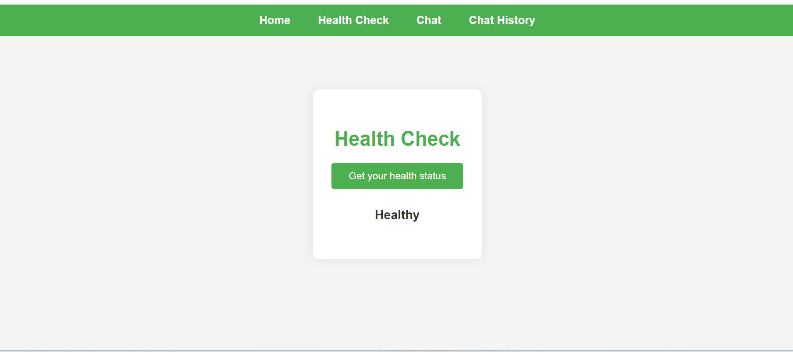

# FastAPI Chat App

This is a beginner-friendly chat application built with **FastAPI**, **Jinja2**, **SQLAlchemy**, and the **Groq API** for AI-powered chat completions. The app features a simple web interface for chatting, health checks, and viewing chat history, with all data stored in a local SQLite database.

---

## Features

- **Home Page**: Welcome page for the app.
- **Health Status Page**: Check if the app is running.
- **Chat Page**: Interact with the AI model (Groq API) and get responses.
- **Chat History Page**: View all previous chat prompts and responses.
- **REST APIs**: For chat completion and health checks.

---

## Technologies Used

- **FastAPI**: Web framework for building APIs and web apps.
- **Jinja2**: Templating engine for rendering HTML pages.
- **SQLAlchemy**: ORM for database operations (using SQLite).
- **Groq API**: For AI chat completions (LLM model, e.g., llama3-70b-8192).
- **dotenv**: For managing environment variables.
- **Python**: Main programming language.

---

## Project Structure

```
fastapi_chat_app/
│   main.py              # Main FastAPI app
│   db.py                # Database setup
│   models.py            # SQLAlchemy models
│   requirements.txt     # Python dependencies
│   chat.db              # SQLite database
│
├── templates/           # HTML templates
│     home.html
│     health.html
│     chat.html
│     chat_history.html
│
├── images/              # Screenshots for demonstration
│     home-page.png
│     health-status-page.png
│     chat-page.png
│     chat-history-page.png
```

---

## How to Run

1. **Clone the repository** and navigate to the `fastapi_chat_app` folder.
2. **Install dependencies** (preferably in a virtual environment):
   ```sh
   pip install -r requirements.txt
   ```
3. **Set up your `.env` file** with your Groq API key and other settings:
   ```env
   GROQ_API_KEY=your_groq_api_key_here
   PORT=8000
   GROQ_MODEL=llama3-70b-8192
   GROQ_MAX_TOKENS=100
   ```
4. **Run the app**:
   ```sh
   uvicorn main:app --reload
   ```
5. **Open your browser** and go to `http://localhost:8000`.

---

## Screenshots

### Home Page


### Health Status Page


### Chat Page


### Chat History Page


---

## API Endpoints

- `GET /` : Home page (HTML)
- `GET /health` : Health status page (HTML)
- `GET /health-check` : Health check API (JSON)
- `GET /chat` : Chat page (HTML)
- `POST /chat-completion` : Get AI chat completion (JSON)
- `GET /chat-history` : Chat history page (HTML)

---

## Notes for Beginners

- All HTML templates are in the `templates/` folder.
- Images for documentation are in the `images/` folder.
- The database is a simple SQLite file (`chat.db`).
- Make sure to set your environment variables in a `.env` file.
- The app uses the Groq API for AI chat responses. You need a valid API key.

---

## License

This project is for learning and personal use.
